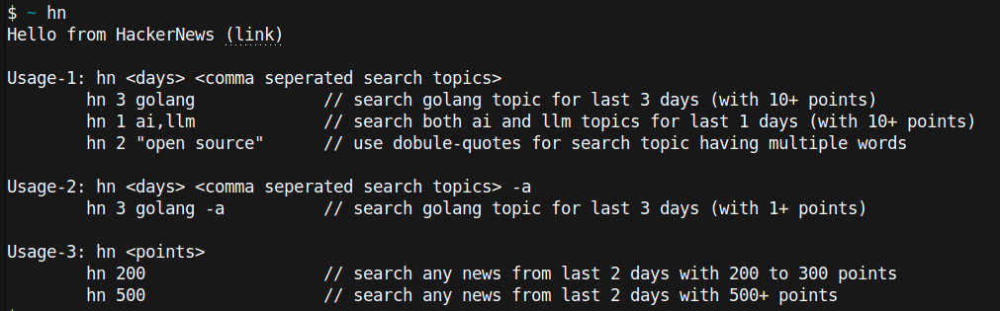
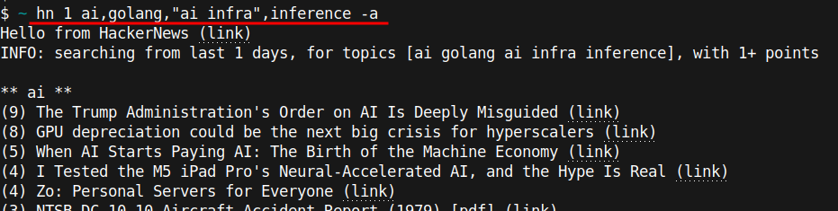

## Overview
**hn** stands for `HackerNews`, it is a command line tool to query hacker news effectively as per user preference.

## Usage

### Help



### Example



### News Workflow

You could have below workflow for your daily news.

- run `hn` tool with topics of your interest.
- use (link) to open in brave browser.
- use Leo AI to summarize the page.

Check below video.

https://github.com/user-attachments/assets/b53d1e62-850f-4f55-a850-8b35bd042edf

## Install

### Linux

```
wget -O hn https://github.com/nurali-techie/hn/releases/download/v1.0.0/hn-linux-amd64
chmod +x hn
mv hn ~/.local/bin/
```

Use `hn` from terminal.

### Mac

```
wget -O hn https://github.com/nurali-techie/hn/releases/download/v1.0.0/hn-darwin-amd64
chmod +x hn
```

Use `./hn` from terminal.

### Windows

```
wget -O hn.exe https://github.com/nurali-techie/hn/releases/download/v1.0.0/hn-windows-amd64.exe
```

Add folder path of `hn.exe` into your PATH variable under system environment variable; after that use `hn` from terminal.

## Contribution

Please help to test Mac and Windows installation.

## References
- HackerNews Search API - https://hn.algolia.com/api
